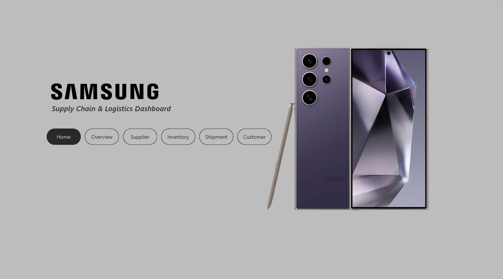
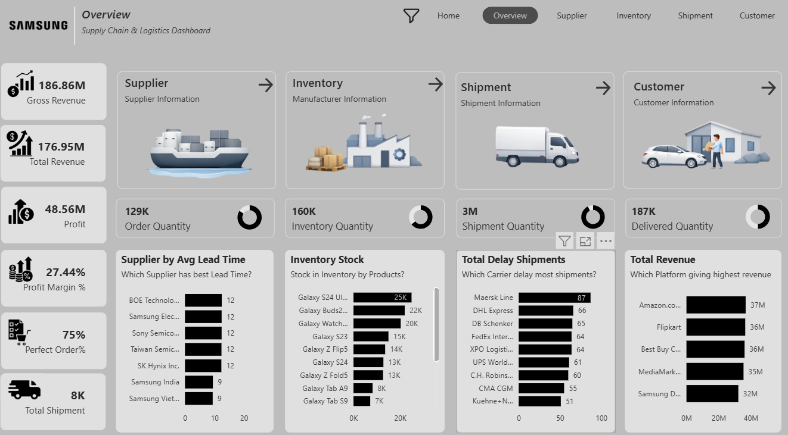
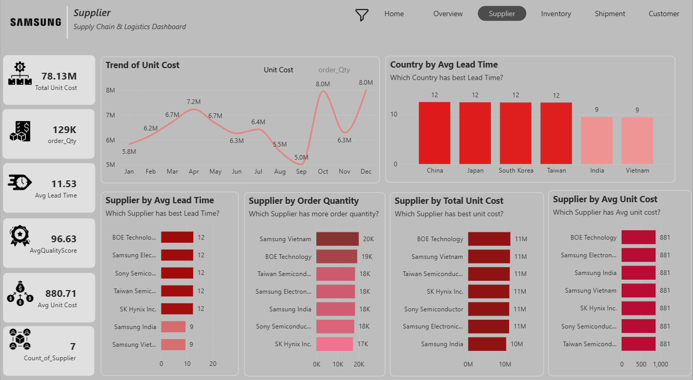
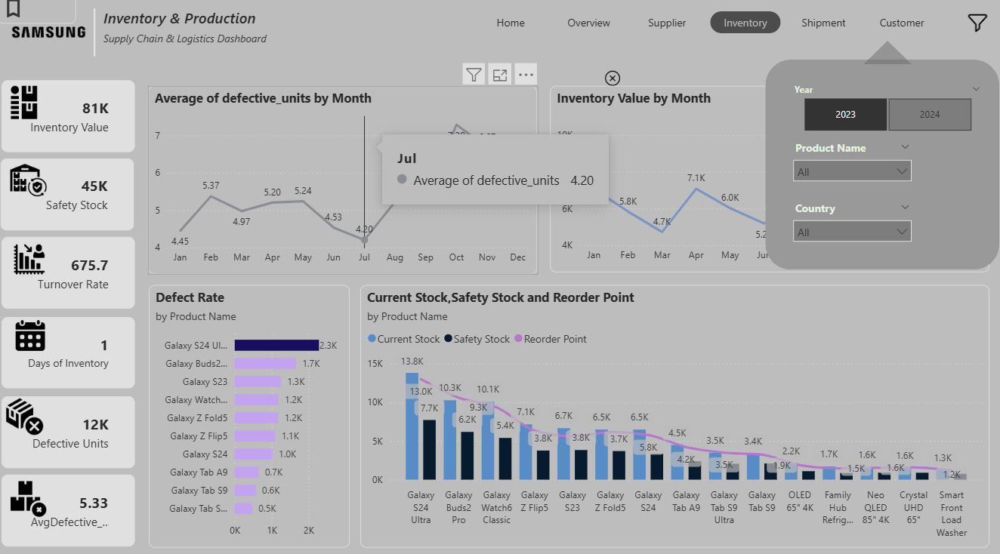
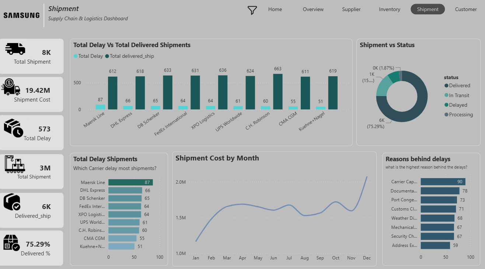
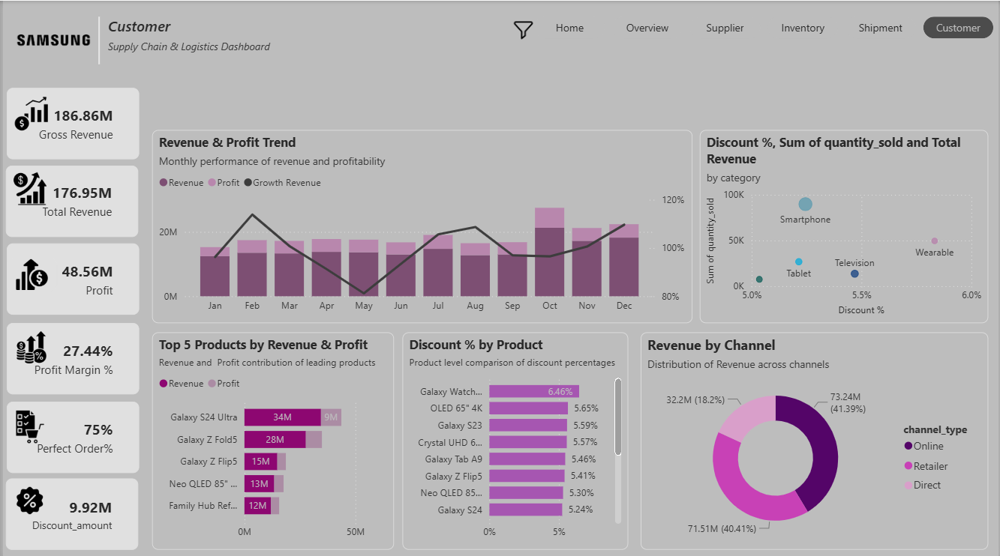

# 📊 Samsung Supply Chain Analytics Dashboard

## 🚀 Project Overview
This project presents an interactive **Supply Chain Analytics Dashboard** built using Power BI to monitor, analyze, and optimize key supply chain operations.  

The dashboard provides real-time insights into **inventory levels, supplier performance, order fulfillment, and delivery efficiency**, enabling data-driven decision-making.

---

## 🎯 Business Problem
Modern supply chains face challenges such as:
- Delayed deliveries
- Poor inventory visibility
- Inefficient supplier performance tracking  

This project aims to solve these issues by transforming raw data into **actionable insights through visualization**.

---

## 💡 Key Features
- 📦 Inventory tracking and stock level monitoring  
- 🚚 Delivery performance and delay analysis  
- 🤝 Supplier performance evaluation  
- 📊 KPI-driven dashboard with interactive filters  
- 🔍 Drill-down analysis for deeper insights  

---

## 📈 Key Insights
- Identified critical **delivery delays** impacting operations  
- Highlighted **top and underperforming suppliers**  
- Improved visibility into **inventory shortages and surplus**  
- Detected **bottlenecks in supply chain flow**  

---

## 🛠 Tools & Technologies
- **Power BI** – Data visualization & dashboard creation  
- **Microsoft Excel** – Data source & preprocessing  
- **DAX** – Calculated measures and KPIs  

---

## 📸 Dashboard Preview
  

---

## 📂 Project Files
- `Samsung-Supply-Chain-Dashboard.pbix` – Power BI file  
- `dashboard1.png`, `dashboard2.png`,`dashboard3.png`,`dashboard4.png`,`dashboard5.png`,`dashboard6.png` – Dashboard screenshots  

---

## ⚠️ Dataset
Dataset not shared due to confidentiality.  

---

## 🔗 How to Use
1. Download the `.pbix` file  
2. Open using Power BI Desktop  
3. Interact with filters and visuals to explore insights  

---

## 🌟 Project Highlights
✔ End-to-end dashboard development  
✔ Real-world business problem solving  
✔ Strong focus on data storytelling  
✔ Clean and interactive UI design  

---

## 👤 Author
**Ayona Stephen**  
📎https://www.linkedin.com/in/ayona-stephen/ 

---

⭐ *If you found this project interesting, feel free to star the repository!*
